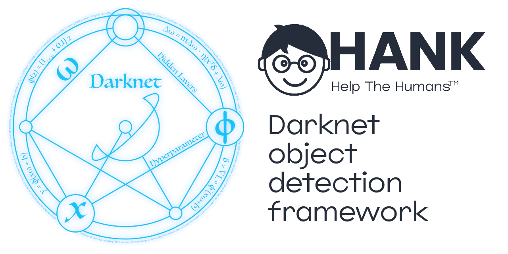
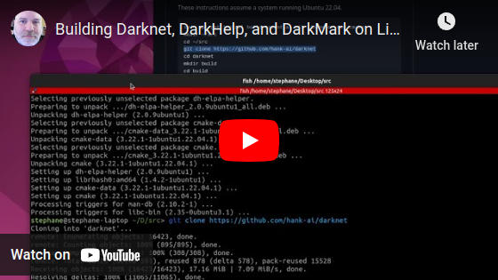

# Table of Contents

* [Darknet Object Detection Framework and YOLO](#darknet-object-detection-framework-and-yolo)
* [Papers](#papers)
* [General Information](#general-information)
* [MSCOCO Pre-trained Weights](#mscoco-pre-trained-weights)
* [Building](#building)
	* [Linux CMake Method](#linux-cmake-method)
	* [Windows CMake Method](#windows-cmake-method)
* [Using Darknet](#using-darknet)
	* [CLI](#cli)
	* [Training](#training)
* [Other Tools and Links](#other-tools-and-links)
* [Roadmap](#roadmap)
	* [Short-term goals](#short-term-goals)
	* [Mid-term goals](#mid-term-goals)
	* [Long-term goals](#long-term-goals)

# Darknet Object Detection Framework and YOLO



Darknet is an open source neural network framework written in C, C++, and CUDA.

YOLO (You Only Look Once) is a state-of-the-art, real-time, object detection system, which runs in the Darknet framework.

* Read how [Hank.ai is helping the Darknet/YOLO community](https://hank.ai/darknet-welcomes-hank-ai-as-official-sponsor-and-commercial-entity/)
* See the Darknet/YOLO web site:  https://darknetcv.ai/
* Please read through the Darknet/YOLO FAQ:  https://www.ccoderun.ca/programming/darknet_faq/
* Join the Darknet/YOLO discord server:  https://discord.gg/zSq8rtW

# Papers

* Paper **YOLOv7**:  https://arxiv.org/abs/2207.02696
* Paper **Scaled-YOLOv4**:  https://openaccess.thecvf.com/content/CVPR2021/html/Wang_Scaled-YOLOv4_Scaling_Cross_Stage_Partial_Network_CVPR_2021_paper.html
* Paper **YOLOv4**:  https://arxiv.org/abs/2004.10934
* Paper **YOLOv3**:  https://arxiv.org/abs/1804.02767

# General Information

YOLOv7 is more accurate and faster than YOLOv5 by **120% FPS**, than YOLOX by **180% FPS**, than Dual-Swin-T by **1200% FPS**, than ConvNext by **550% FPS**, than SWIN-L by **500% FPS**, and PPYOLOE-X by **150% FPS**.

YOLOv7 surpasses all known object detectors in both speed and accuracy in the range from 5 FPS to 160 FPS and has the highest accuracy 56.8% AP among all known real-time object detectors with 30 FPS or higher on GPU V100, batch=1.


# MSCOCO Pre-trained Weights

Several popular versions of YOLO were pre-trained for convenience on the [MSCOCO dataset](https://cocodataset.org/).  This dataset has 80 classes, which can be seen in the text file [`cfg/coco.names`](cfg/coco.names).

The pre-trained weights can be downloaded from several different locations, and are also available for download from this repo:

* YOLOv2, November 2016
  * [YOLOv2-tiny](https://github.com/hank-ai/darknet/issues/21#issuecomment-1807469361)
  * [YOLOv2-full](https://github.com/hank-ai/darknet/issues/21#issuecomment-1807478865)
* YOLOv3, May 2018
  * [YOLOv3-tiny](https://github.com/hank-ai/darknet/issues/21#issuecomment-1807479419)
  * [YOLOv3-full](https://github.com/hank-ai/darknet/issues/21#issuecomment-1807480139)
* YOLOv4, May 2020
  * [YOLOv4-tiny](https://github.com/hank-ai/darknet/issues/21#issuecomment-1807480542)
  * [YOLOv4-full](https://github.com/hank-ai/darknet/issues/21#issuecomment-1807481315)
* YOLOv7, August 2022
  * [YOLOv7-tiny](https://github.com/hank-ai/darknet/issues/21#issuecomment-1807483279)
  * [YOLOv7-full](https://github.com/hank-ai/darknet/issues/21#issuecomment-1807483787)

The MSCOCO pre-trained weights are provided for demo-purpose only.  People are expected to [train their own networks](#training).

# Building

The various build methods available in the past have been merged together into a single unified solution.  Darknet requires OpenCV, and uses CMake to generate the necessary project files.

* [Linux](#linux-cmake-method)
* [Windows](#windows-cmake-method)

**Beware if you are following old tutorials with more complicated build steps, or build steps that don't match what is in this readme.**  The new build steps as described below started in August 2023.

Software developers are encouraged to visit https://darknetcv.ai/ to get information on the internals of the Darknet/YOLO object detection framework.

## Linux CMake Method

[](https://www.youtube.com/watch?v=WTT1s8JjLFk)

* Optional:  If you have a modern NVIDIA GPU, you can install either CUDA or CUDA+cuDNN at this point.  If installed, Darknet will use your GPU to speed up image (and video) processing.
	* Visit <https://developer.nvidia.com/cuda-downloads> to download and install CUDA.
	* Visit <https://developer.nvidia.com/rdp/cudnn-download> or <https://docs.nvidia.com/deeplearning/cudnn/install-guide/index.html#cudnn-package-manager-installation-overview> to download and install cuDNN.
	* Once you install CUDA make sure you can run `nvcc` and `nvidia-smi`.  You may have to [modify your `PATH` variable](https://docs.nvidia.com/cuda/cuda-installation-guide-linux/index.html#mandatory-actions).
	* If you install CUDA or CUDA+cuDNN at a later time, or you upgrade to a newer version of the NVIDIA software:
		* You must delete the `CMakeCache.txt` file from your Darknet `build` directory to force CMake to re-find all of the necessary files.
		* Remember to re-build Darknet.

These instructions assume a system running Ubuntu 22.04.

```sh
sudo apt-get install build-essential git libopencv-dev cmake
mkdir ~/src
cd ~/src
git clone https://github.com/hank-ai/darknet
cd darknet
mkdir build
cd build
cmake -DCMAKE_BUILD_TYPE=Release ..
make -j4 package
sudo dpkg -i darknet-VERSION.deb
```

If you are using an older version of CMake then you'll need to upgrade CMake before you can run the `cmake` command above.  Upgrading CMake on Ubuntu can be done with the following commands:

```sh
sudo apt-get purge cmake
sudo snap install cmake --classic
```

> Advanced users:
>
> If you want to build a RPM installation file instead of a DEB file, see the relevant lines in `CM_package.cmake`.  Prior to running `make -j4 package` you'll need to edit these two lines:

```cmake
SET (CPACK_GENERATOR "DEB")
# SET (CPACK_GENERATOR "RPM")
```

> For distros such as Centos and OpenSUSE, you'll need to switch those two lines in `CM_package.cmake` to be:

```cmake
# SET (CPACK_GENERATOR "DEB")
SET (CPACK_GENERATOR "RPM")
```

To install the installation package, use the usual package manager for your distribution.  For example, on Debian-based systems such as Ubuntu:

```sh
sudo dpkg -i darknet-2.0.1-Linux.deb
```

Installing the package will copy the following files:

* `/usr/bin/darknet` is the usual Darknet executable.  Run `darknet version` from the CLI to confirm it is installed correctly.
* `/usr/include/darknet.h` is the Darknet API for C, C++, and Python developers.
* `/usr/include/darknet_version.h` contains version information for developers.
* `/usr/lib/libdarknet.so` is the library to link against for C, C++, and Python developers.
* `/opt/darknet/cfg/...` is where all the `.cfg` templates are stored.

You are now done!  Darknet has been built and installed into `/usr/bin/`.  Run this to test:  `darknet version`.

> If you don't have /usr/bin/darknet` then this means you _did not_ install it, you only built it!  Make sure you install the `.deb` or `.rpm` file as described above.

## Windows CMake Method

These instructions assume a brand new installation of Windows 11 22H2.

Open a normal `cmd.exe` command prompt window and run the following commands:

```bat
winget install Git.Git
winget install Kitware.CMake
winget install nsis.nsis
winget install Microsoft.VisualStudio.2022.Community
```

At this point we need to modify the Visual Studio installation to include support for C++ applications:

* click on the "Windows Start" menu and run "Visual Studio Installer"
* click on `Modify`
* select `Desktop Development With C++`
* click on `Modify` in the bottom-right corner, and then click on `Yes`

Once everything is downloaded and installed, click on the "Windows Start" menu again and select `Developer Command Prompt for VS 2022`.  **Do not** use PowerShell for these steps, you will run into problems!

> Advanced users:
>
> Instead of running the `Developer Command Prompt`, you can use a normal command prompt or ssh into the device and manually run `"\Program Files\Microsoft Visual Studio\2022\Community\Common7\Tools\VsDevCmd.bat"`.

Once you have the Developer Command Prompt running as described above, run the following commands to install Microsoft VCPKG, which will then be used to build OpenCV:

```bat
cd c:\
mkdir c:\src
cd c:\src
git clone https://github.com/microsoft/vcpkg
cd vcpkg
bootstrap-vcpkg.bat
.\vcpkg.exe integrate install
.\vcpkg.exe integrate powershell
.\vcpkg.exe install opencv[contrib,dnn,freetype,jpeg,openmp,png,webp,world]:x64-windows pthreads:x64-windows
```

Be patient at this last step as it can take a long time to run.  It needs to download and build many things.

> Advanced users:
>
> Note there are many other optional modules you may want to add when building OpenCV.  Run `.\vcpkg.exe search opencv` to see the full list.

* Optional:  If you have a modern NVIDIA GPU, you can install either CUDA or CUDA+cuDNN at this point.  If installed, Darknet will use your GPU to speed up image (and video) processing.
	* Visit <https://developer.nvidia.com/cuda-downloads> to download and install CUDA.
	* Visit <https://developer.nvidia.com/rdp/cudnn-download> or <https://docs.nvidia.com/deeplearning/cudnn/install-guide/index.html#download-windows> to download and install cuDNN.
	* Once you install CUDA make sure you can run `nvcc` and `nvidia-smi`.  You may have to modify your `PATH` variable.
	* If you install CUDA or CUDA+cuDNN at a later time, or you upgrade to a newer version of the NVIDIA software:
		* You must delete the `CMakeCache.txt` file from your Darknet `build` directory to force CMake to re-find all of the necessary files.
		* Remember to re-build Darknet.
	* CUDA **must** be installed **after** Visual Studio.  If you upgrade Visual Studio, remember to re-install CUDA.

Once all of the previous steps have finished successfully, you need to clone Darknet and build it.  During this step we also need to tell CMake where vcpkg is located so it can find OpenCV and other dependencies:

```bat
cd c:\src
git clone https://github.com/hank-ai/darknet.git
cd darknet
mkdir build
cd build
cmake -DCMAKE_BUILD_TYPE=Release -DCMAKE_TOOLCHAIN_FILE=C:/src/vcpkg/scripts/buildsystems/vcpkg.cmake ..
msbuild.exe /property:Platform=x64;Configuration=Release /target:Build -maxCpuCount -verbosity:normal -detailedSummary darknet.sln
msbuild.exe /property:Platform=x64;Configuration=Release PACKAGE.vcxproj
```

If you get an error about some missing CUDA DLLs such as `cublas64_12.dll`, then manually copy the CUDA `.dll` files into the same output directory as `Darknet.exe`.  For example:
```bat
copy "C:\Program Files\NVIDIA GPU Computing Toolkit\CUDA\v12.2\bin\*.dll" src-cli\Release\
```
Similarly, if you get an error about CUDNN, then manually copy the CUDNN `.dll` file into the same output directory.  For example:
```bat
copy "C:\Program Files\NVIDIA\CUDNN\v8.x\bin\cudnn64_8.dll" src-cli\Release\
```
Once the files have been copied, re-run the last `msbuild.exe` command to generate the NSIS installation package:
```bat
msbuild.exe /property:Platform=x64;Configuration=Release PACKAGE.vcxproj
```

> Advanced users:
>
> Note that the output of the `cmake` command is a normal Visual Studio solution file, `Darknet.sln`.  If you are a software developer who regularly uses the Visual Studio GUI instead of `msbuild.exe` to build projects, you can ignore the command-line and load the Darknet project in Visual Studio.

You should now have this file you can run:  `C:\src\Darknet\build\src-cli\Release\darknet.exe`.  Run this to test:  `C:\src\Darknet\build\src-cli\Release\darknet.exe version`.

To correctly install Darknet, the libraries, the include files, and the necessary DLLs, run the NSIS installation wizard that was built in the last step.  See the file `darknet-VERSION.exe` in the `build` directory.  For example:
```bat
darknet-2.0.31-win64.exe
```

Installing the NSIS installation package will:

* Create a directory called `Darknet`, such as `C:\Program Files\Darknet\`.
* Install the CLI application, `darknet.exe`.
* Install the required 3rd-party `.dll` files, such as those from OpenCV.
* Install the neccesary Darknet `.dll`, `.lib` and `.h` files to use `darknet.dll` from another application.
* Install the template `.cfg` files.

You are now done!  Once the installation wizard has finished, Darknet will have been installed into `C:\Program Files\Darknet\`.  Run this to test:  `C:\Program Files\Darknet\bin\darknet.exe version`.

> If you don't have `C:/Program Files/darknet/bin/darknet.exe` then this means you _did not_ install it, you only built it!  Make sure you go through each panel of the NSIS installation wizard in the previous step.

# Using Darknet

## CLI

The following is not the full list of all commands supported by Darknet.  See [the previous readme](README_previous.md) for additional details and examples.

> In addition to the Darknet CLI, also note [the DarkHelp project CLI](https://github.com/stephanecharette/DarkHelp#what-is-the-darkhelp-cli) which provides an alternative CLI to Darknet/YOLO.  The DarkHelp CLI also has several advanced features that are not available directly in Darknet.  You can use both the Darknet CLI and the DarkHelp CLI together, they are not mutually exclusive.

For most of the commands shown below, you'll need the `.weights` file with the corresponding `.names` and `.cfg` files.  You can either [train your own network](#training) (highly recommended!) or [download the MSCOCO pre-trained `.weights` files](#mscoco-pre-trained-weights).  The `.cfg` and `.names` files are in the [cfg](cfg/) directory in the repo.

* Check the version:  `darknet version`
* Obtain some (very limited!) assitance on some commands to run:  `darknet help`
* Predict using an image:  `darknet detector test animals.data animals.cfg animals_best.weights dog.jpg`
* Download YOLOv4-tiny weights and predict using a sample image in the `artwork` directory:
```sh
cd src/darknet/
wget --no-clobber https://github.com/hank-ai/darknet/releases/download/v2.0/yolov4-tiny.weights
darknet detector test cfg/coco.data cfg/yolov4-tiny.cfg yolov4-tiny.weights artwork/dog.jpg
```
* The equivalent command when using DarkHelp would be:
```sh
cd src/darknet/
DarkHelp cfg/coco.names cfg/yolov4-tiny.cfg yolov4-tiny.weights artwork/dog.jpg
# The order in which you list the .names, .cfg, and .weights file is not important for DarkHelp.
```
* Output coordinates:  `darknet detector test animals.data animals.cfg animals_best.weights -ext_output dog.jpg`
* Working with videos:  `darknet detector demo animals.data animals.cfg animals_best.weights -ext_output test.mp4`
* Reading from a webcam:  `darknet detector demo animals.data animals.cfg animals_best.weights -c 0`
* Smart webcam:  `darknet detector demo animals.data animals.cfg animals_best.weights http://192.168.0.80:8080/video?dummy=param.mjpg`
* Save results to a video:  `darknet detector demo animals.data animals.cfg animals_best.weights test.mp4 -out_filename res.avi`
* JSON and MJPEG server:  `darknet detector demo animals.data animals.cfg animals_best.weights test50.mp4 -json_port 8070 -mjpeg_port 8090 -ext_output`
* Running on a specific GPU:  `darknet detector demo animals.data animals.cfg animals_best.weights -i 1 test.mp4`
* To check the accuracy of the neural network:
```sh
darknet detector map driving.data driving.cfg driving_best.weights
...
  Id Name             AvgPrecision     TP     FN     FP     TN Accuracy ErrorRate Precision Recall Specificity FalsePosRate
  -- ----             ------------ ------ ------ ------ ------ -------- --------- --------- ------ ----------- ------------
   0 vehicle               91.2495  32648   3903   5826  65129   0.9095    0.0905    0.8486 0.8932      0.9179       0.0821
   1 motorcycle            80.4499   2936    513    569   5393   0.8850    0.1150    0.8377 0.8513      0.9046       0.0954
   2 bicycle               89.0912    570    124    104   3548   0.9475    0.0525    0.8457 0.8213      0.9715       0.0285
   3 person                76.7937   7072   1727   2574  27523   0.8894    0.1106    0.7332 0.8037      0.9145       0.0855
   4 many vehicles         64.3089   1068    509    733  11288   0.9087    0.0913    0.5930 0.6772      0.9390       0.0610
   5 green light           86.8118   1969    239    510   4116   0.8904    0.1096    0.7943 0.8918      0.8898       0.1102
   6 yellow light          82.0390    126     38     30   1239   0.9525    0.0475    0.8077 0.7683      0.9764       0.0236
   7 red light             94.1033   3449    217    451   4643   0.9237    0.0763    0.8844 0.9408      0.9115       0.0885
```
* To check accuracy mAP@IoU=75:  `darknet detector map animals.data animals.cfg animals_best.weights -iou_thresh 0.75`
* Recalculating anchors is best done in DarkMark, since it will run 100 consecutive times and select the best anchors from all the ones that were calculated.  But if you want to run the old version in Darknet:
```sh
darknet detector calc_anchors animals.data -num_of_clusters 6 -width 320 -height 256
```
* Train a new network:  `darknet detector -map -dont_show train animals.data animals.cfg` (also see [the training section](#training) below)

## Training

Quick links to relevant sections of the Darknet/YOLO FAQ:
* [How should I setup my files and directories?](https://www.ccoderun.ca/programming/yolo_faq/#directory_setup)
* [Which configuration file should I use?](https://www.ccoderun.ca/programming/yolo_faq/#configuration_template)
* [What command should I use when training my own network?](https://www.ccoderun.ca/programming/yolo_faq/#training_command)

The simplest way to annotate and train is with the use of [DarkMark](https://github.com/stephanecharette/DarkMark) to create all of the necessary Darknet files.  This is definitely the recommended way to train a new neural network.

If you'd rather manually setup the various files to train a custom network:

* Create a new folder where the files will be stored.  For this example, a neural network will be created to detect animals, so the following directory is created:  `~/nn/animals/`.
* Copy one of the Darknet configuration files you'd like to use as a template.  For example, see `cfg/yolov4-tiny.cfg`.  Place this in the folder you created.  For this example, we now have `~/nn/animals/animals.cfg`.
* Create a `animals.names` text file in the same folder where you placed the configuration file.  For this example, we now have `~/nn/animals/animals.names`.
* Edit the `animals.names` file with your text editor.  List the classes you want to use.  You need to have exactly 1 entry per line, with no blank lines and no comments.  For this example, the `.names` file will contain exactly 4 lines:
```txt
dog
cat
bird
horse
```

* Create a `animals.data` text file in the same folder.  For this example, the `.data` file will contain:
```txt
classes = 4
train = /home/username/nn/animals/animals_train.txt
valid = /home/username/nn/animals/animals_valid.txt
names = /home/username/nn/animals/animals.names
backup = /home/username/nn/animals
```

* Create a folder where you'll store your images and annotations.  For example, this could be `~/nn/animals/dataset`.  Each image will need a coresponding `.txt` file which describes the annotations for that image.  The format of the `.txt` annotation files is very specific.  You cannot create these files by hand since each annotation needs to contain the exact coordinates for the annotation.  See [DarkMark](https://github.com/stephanecharette/DarkMark) or other similar software to annotate your images.  The YOLO annotation format is described in the [Darknet/YOLO FAQ](https://www.ccoderun.ca/programming/yolo_faq/#darknet_annotations).
* Create the "train" and "valid" text files named in the `.data` file.  These two text files need to individually list all of the images which Darknet must use to train and for validation when calculating the mAP%.  Exactly one image per line.  The path and filenames may be relative or absolute.
* Modify your `.cfg` file with a text editor.
  * Make sure that `batch=64`.
  * Note the subdivisions.  Depending on the network dimensions and the amount of memory available on your GPU, you may need to increase the subdivisions.  The best value to use is `1` so start with that.  See the [Darknet/YOLO FAQ](https://www.ccoderun.ca/programming/yolo_faq/#cuda_out_of_memory) if `1` doesn't work for you.
  * Note `max_batches=...`.  A good value to use when starting out is 2000 x the number of classes.  For this example, we have 4 animals, so 4 * 2000 = 8000.  Meaning we'll use `max_batches=8000`.
  * Note `steps=...`.  This should be set to 80% and 90% of `max_batches`.  For this example we'd use `steps=6400,7200` since `max_batches` was set to 8000.
  * Note `width=...` and `height=...`.  These are the network dimensions.  The Darknet/YOLO FAQ explains [how to calculate the best size to use](https://www.ccoderun.ca/programming/darknet_faq/#optimal_network_size).
  * Search for all instances of the line `classes=...` and modify it with the number of classes in your `.names` file.  For this example, we'd use `classes=4`.
  * Search for all instances of the line `filters=...` in the `[convolutional]` section **prior** to each `[yolo]` section.  The value to use is (number_of_classes + 5) * 3.  Meaning for this example, (4 + 5) * 3 = 27.  So we'd use `filters=27` on the appropriate lines.
* Start training!  Run the following commands:
```sh
cd ~/nn/animals/
darknet detector -map -dont_show train animals.data animals.cfg
```

Be patient.  The best weights will be saved as `animals_best.weights`.  And the progress of training can be observed by viewing the `chart.png` file.  See [the Darknet/YOLO FAQ](https://www.ccoderun.ca/programming/yolo_faq/#training_command) for additional parameters you may want to use when training a new network.

# Other Tools and Links

* To manage your Darknet/YOLO projects, annotate images, verify your annotations, and generate the necessary files to train with Darknet, [see DarkMark](https://github.com/stephanecharette/DarkMark).
* For a robust alternative CLI to Darknet, to use image tiling, for object tracking in your videos, or for a robust C++ API that can easily be used in commercial applications, [see DarkHelp](https://github.com/stephanecharette/DarkHelp).
* See if [the Darknet/YOLO FAQ](https://www.ccoderun.ca/programming/darknet_faq/) can help answer your questions.
* See the many tutorial and example videos on [Stéphane's YouTube channel](https://www.youtube.com/c/StephaneCharette/videos)
* If you have a support question or want to chat with other Darknet/YOLO users, [join the Darknet/YOLO discord server](https://discord.gg/zSq8rtW).

# Roadmap

Last updated 2024-02-12:

## Short-term goals

* [X] convert Darknet to use the C++ compiler (g++ on Linux, VisualStudio on Windows)
* [X] fix Windows build
* [ ] fix ARM build (Jetson devices)
* [X] fix Python support
* [ ] clean up .hpp files
* [ ] re-write darknet.h
* [X] build darknet library
* [X] re-enable labels on predictions ("alphabet" code)
* [X] re-enable CUDA/GPU code
* [X] re-enable CUDNN
* [X] re-enable CUDNN half
* [X] do not hard-code the CUDA architecture
* [X] better CUDA version information
* [X] re-enable AVX
* [ ] look into old zed camera support
* [X] remove old solutions and Makefile
* [ ] make OpenCV non-optional
* [ ] better and more consistent command line parsing
* [X] remove STB
* [X] re-write CMakeLists.txt to use the new CUDA detection
* [X] remove old "alphabet" code, and delete the 700+ images in data/labels
* [X] build out-of-source
* [X] have better version number output

## Mid-term goals

* [ ] better use of `cv::Mat` instead of the custom `image` structure in C
* [ ] do not cast `cv::Mat` to `void*` but use it as a proper C++ object
* [ ] completely remove internal/obsolete `image` structure
* [ ] fix support for 1-channel greyscale images
* [ ] add support for N-channel images where N > 3 (e.g., images with an additional depth or thermal channel)
* [ ] on-going code cleanup

## Long-term goals

* [ ] fix CUDA/CUDNN issues with all GPUs
* [ ] look into adding support for non-NVIDIA GPUs
* [ ] rotated bounding boxes, or some sort of "angle" support

